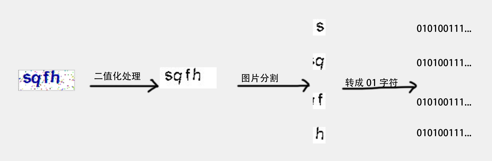

# 基于机器学习识别正方系统验证码



## 获取依赖项目
```bash
git submodule init
git submodule update
```

* training_model:   训练模型
* dat.data:        样本处理后的数据
* zfxfzb-code-data: 获取样本数据
* distribution.py:  数据分布情况

## 数据张量
* 输入： 336 = 16*21
* 输出： 36 

## 样本数据分布情况图

